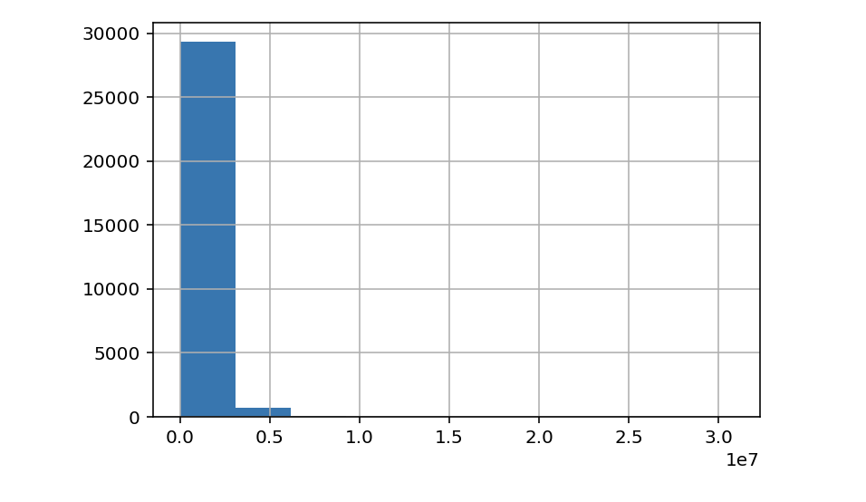
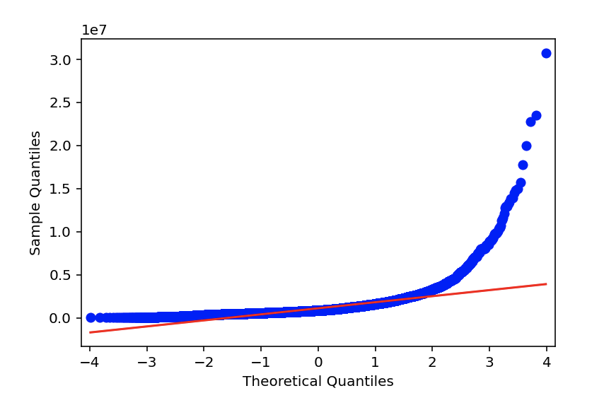
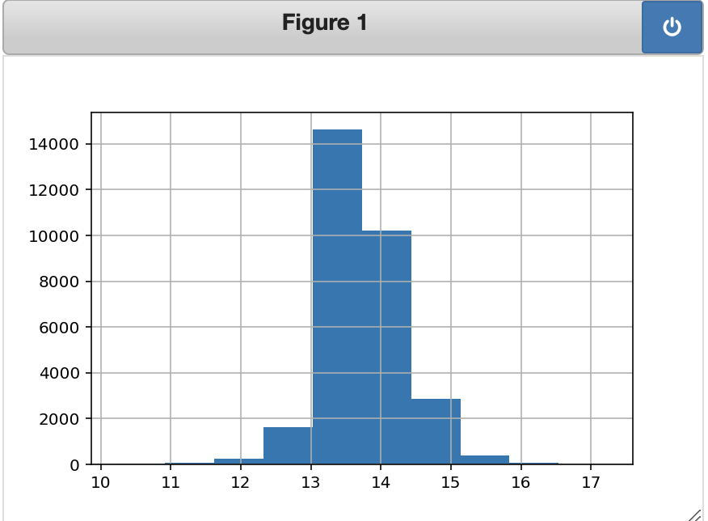
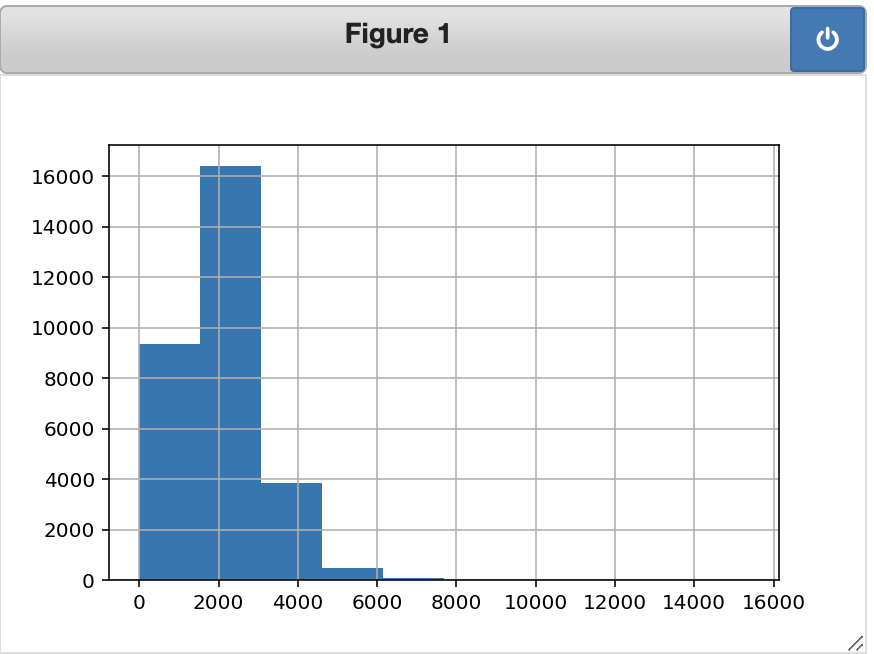
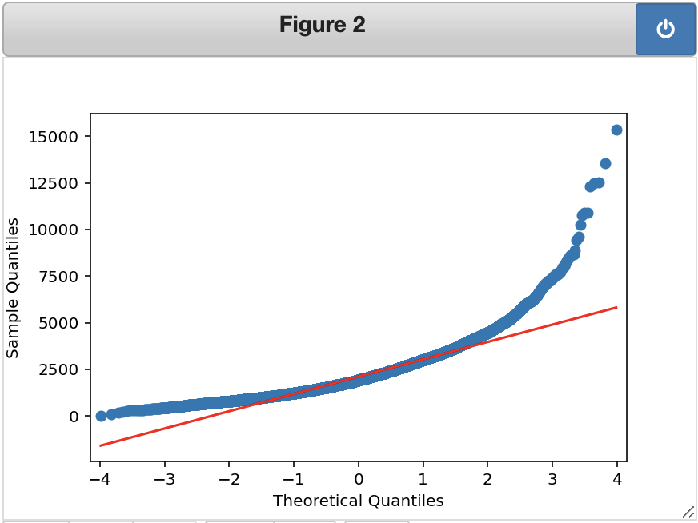
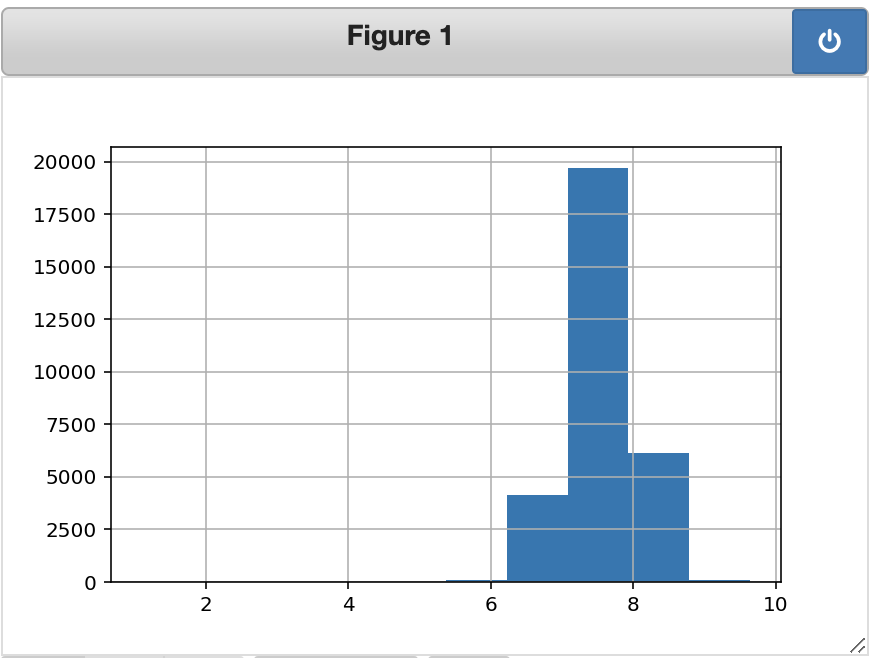
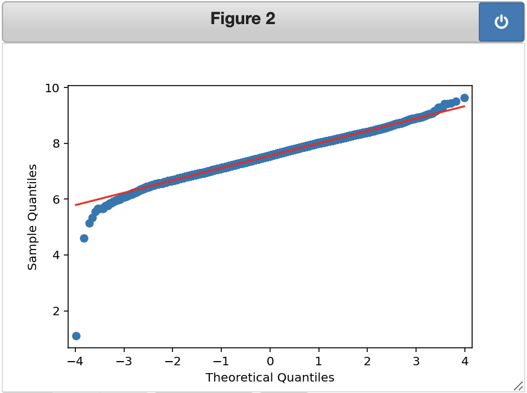

# King County Housing Data Project

## Overview

A company that buys houses to flip and resell is interested in finding out what pre-existine features of houses are likely to lead to a higher sale price. Since they plan on "flipping" the house, or adding their own renovations, they aren't as interested in details such as the overall condition of the house and are more interested in things such as location, how big of a lot the house is built on, etc.

## Business Understanding

The features of the data from a housing dataset that I will be looking at, and comparing to the sale price of the houses, include number of bedrooms, number of bathrooms, square footage of the living area, square footage of the lot, number of floors, whether the house is on a waterfront, whether the house is adjacent to a green belt, whether the house has traffic noise or other nuisances, and the quality of the view of the house. After performing exploratory data analysis and determining which of these factors seem to relate to sale price, I will narrow down my efforts to determine which of those factors are the best predictors of sale price.

## Data Understanding

I begin by importing the necessary modules and the dataset I will be using, which includes housing data for King County.

Next, I try to find out more about the data and narrow down the dataframe I will be using to only include the necessary columns.

## Data Preparation

Before I look at the predictors, I want to investigate the target variable ("price"). I start by plotting the target variable's distribution with a histogram and its residuals with a QQ plot. The histogram does not seem to show a very normal looking distribution, and the QQ plot shows the residuals getting further and further away from the theoretical fit line. 

I then try to log transform the target variable to see if that improves its distribution or the distribution of its residuals. It does look like this distribution is more normal based on the histogram, and the residuals seem to follow the theoretical fit line more closely.

I want to know which variables are most correlated with price, so that I can choose a feature for the baseline model. However, first I want to make sure there is no multicollinearity that will later affect my results.
I do this by comparing all the features' correlations to see if any features are highly correlated with each other. The only pairs of features that have correlations higher than 0.75 (high correlations) are sqft_living and sqft_above, and sqft_living and bathrooms. This makes sense, because the square feet of the living area is likely a large portion of the square feet above ground for a house. 
Also, it would make sense that the larger amount of square footage of living space, the higher number of bathrooms a house would have. Following this same logic, one might think that the 'bedrooms' feature would also cause multicollinearity, however as this does not seem to be particularly highly correlated with price I will leave it in for now.
Because sqft_living is more correlated with the target variable, price, I am going to exclude the variables sqft_above and bathrooms moving forward.

###### Now, to look at the rest of the features: 

Of the numeric variables in the data, aside from those already removed, it looks like the feature most correlated with price is sqft_living. The second most correlated feature with price is bedrooms.

Scatter plots can then be useful to visualize which features appear to have a linear relationship with the target (price).

The numeric variable here that appears to have the strongest positive linear relationship with price is sqft_living. As the feature most correlated with price and the one with the strongest linear relationship, sqft_living seems to  be a good variable to build a baseline model with to then compare other variables to.

Now, I want to investigate the distribution of sqft_living to see if it is normal and if its residuals follow the theoretical model.

The histogram of sqft_living does not look very normal, and much like the QQ plot of price, the residuals also tend to get further away from the theoretical line. To see if it improves the distribution, I am going to try log transforming this variable.

The transformed feature's distribution looks much more normal than the untransformed variable, and the residuals follow the theoretical line better as well.

## Modeling

First, a baseline model is created using the variable sqft_living, as it is the most correlated with sale price, to compare all other models to.

<!--This baseline model explains 37% of the variance in sale price of the houses in this dataset and it is statistically significant. Looking at the coefficients, for each increase by 1 square foot of living area, we expect the house's sale price to increase by $560-->

To further visualize these results, I plot the actual vs. predicted values for this model, the regression line, and the residuals.
###### Actuals vs. Predicted values:

###### The Regression Line:

###### The Residuals:

#### Numeric data:

I then add the other numeric features to a multiple linear regression to see if it improves our model.

These models look worse, so likely we included too many features. Since the numeric features of bedrooms, sqft_lot, and floors do not appear to have a positive linear relationship with price, we will remove those features.

Including bathrooms and sqft_living features improved the model but only slightly.

#### Categorical data

Now, before the categorical variables can be modeled, they will need to be transformed using one-hot encoding.

For each of these categorical variables:

The model with waterfront explains about 5 percent of the variance in price and the F-statistic is statistically significant. Compared to houses that are not on a waterfront, we see a price increase of about 1,601,000 dollars for houses that are on a waterfront.

The model with greenbelt explains about 0.5 percent of the variance in price and the F-statistic is statistically significant. Compared to houses that are not near a greenbelt, we see a price increase of about 387,100 dollars for houses that are.

The model with nuisance explains 0 percent of the variance in price and it is statistically significant. This may indicate that this model is not suited for linear regression.

The model with view explains about 11.7 percent of the variance in price and it has an F-statistic of 0, so it is statistically significant. Compared to houses with an average view, we see a price increase of about 1,542,000 dollars for an excellent view, about 284,400 dollars for a good view, about 290,100 dollars for a fair view, and a decrease of about 433,400 dollars for no view.

<!-- Attempting a log function??-->
<!--For some reason it appears that houses with nuisance have a slightly higher average price than those without which is unexpected. However, this model does not seem to be a good predictor of price anyway.-->

Of the categorical variables, the ones that appear to be the best predictors of price are view and waterfront. Of the numeric variables, the one that appears to be the best predictor is sqft_living.

## Regression Results 

(For Interaction results:)

(Const = 207495.18)
This means that for the reference category of having an average view and average square feet of living area, we expect to see a sale price of about 207,495 dollars.

(params for view_EXCELLENT = 13407.75)
Having an excellent view, as opposed to having an average view, is associated with an increase of about 13,407 dollars in sale price with average square feet of living area.

(const + view_EXCELLENT = 220902.93)
For houses with an excellent view and average and average sqare feet of living area, we expect to see a price of about 220,902 dollars.

### Creating an interaction term ('Excellent' view):

Of the categorical variables, view seems to be the best predictor of price. We will create an interaction term between view and sqft_living to see if the interaction of these two features improve the model.

This model explains about 42.5% of the error in price and is statistically significant, which is an improvement from our baseline model that only explained about 37% of the variance.

<!--sqft_living coef is significant but not view_EXCELLENT - what does this mean??-->

MAE:

mae of baseline = 396335.99
Our baseline model is off by about $396,336 in a given prediction.

mae of interaction = 384550.34
Our interaction model is off by about $384,550 in a given prediction. This is still high, but it is better than our baseline model.

###### Because the client intends to buy houses to flip them and resell for a higher price, it may be interesting to see how the condition of the house as well as the year it was renovated can affect the price, compared to the other features of the house.

It looks like of the houses that have been renovated, the earliest renovation date was in 1924 and the latest was in 2022.

## Conclusion

