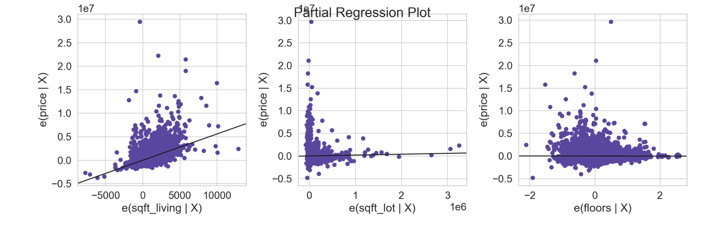

# King County Housing Data Project

## Overview

A company that buys houses to flip and resell is interested in finding out what pre-existine features of houses are likely to lead to a higher sale price. Since they plan on "flipping" the house, or adding their own renovations, they aren't as interested in details such as the overall condition of the house and are more interested in things such as location, how big of a lot the house is built on, etc.

## Data Understanding

I begin by importing the necessary modules and the dataset I will be using, which includes housing data for King County.

Next, I try to find out more about the data and narrow down the dataframe I will be using to only include the necessary columns.

## Data Preparation

Before I look at the predictors, I want to investigate the target variable ("price"). I start by plotting the target variable's distribution with a histogram and its residuals with a QQ plot. 

The histogram does not seem to show a perfectly normal looking distribution, and the QQ plot shows the residuals getting further and further away from the theoretical fit line. 

This indicates that the data becomes unreliable outside of plus or minus 2 standard deviations from the mean, or outside of the range where price equals between 684,205.75 and 2,901,227.43 dollars.

#### Choosing a baseline model feature:

Next, I want to know which variables are most correlated with price, so that I can choose a feature for the baseline model. 
However, first I want to make sure that if any features are causing multicollinearity, that they are removed so that they will not later affect my results.
I do this by comparing all the features' correlations to see if any features are highly correlated with each other.

The only pairs of features that have correlations higher than 0.75 (high correlations) are sqft_living and sqft_above, and sqft_living and bathrooms. This makes sense, because the square feet of the living area is likely a large portion of the square feet above ground for a house. 

Also, it would make sense that the larger amount of square footage of living space, the higher number of bathrooms a house would have. Following this same logic, one might think that the 'bedrooms' feature would also cause multicollinearity. 

Looking at the correlations, I see that the bedrooms and bathrooms features are more correlated with the feature 'sqft_living' than they are with price, so this indicates multicollinearity.
Because sqft_living is the most correlated with the target variable out of these, I am going to exclude the variables sqft_above, bedrooms, and bathrooms moving forward.

##### Now, to look at the rest of the features: 

Paying more attention to which variables are correlated with price, as opposed to with each other, I compare the rest of the relevant numeric features.

## Modeling

First, a baseline model is created using the variable sqft_living, as it is the most correlated with sale price, to compare all other models to.

This model is statistically significant and explains about 37% of the variance in price.

#### Numeric data:

I then add the other numeric features to a multiple linear regression to see if it improves our model.

These models look worse, so likely we included too many features. Since the numeric features of sqft_lot, and floors do not appear to have a positive linear relationship with price, we will remove those features.

#### Categorical data

The model with waterfront explains about 5 percent of the variance in price and the F-statistic is statistically significant. Compared to houses that are not on a waterfront, we see a price increase of about 1,601,000 dollars for houses that are on a waterfront.

The model with greenbelt explains about 0.5 percent of the variance in price and the F-statistic is statistically significant. Compared to houses that are not near a greenbelt, we see a price increase of about 387,100 dollars for houses that are.

The model with nuisance explains 0 percent of the variance in price and it is statistically significant. This may indicate that this model is not suited for linear regression.

The model with view explains about 11.7 percent of the variance in price and it has an F-statistic of 0, so it is statistically significant. Compared to houses with an average view, we see a price increase of about 1,542,000 dollars for an excellent view, about 284,400 dollars for a good view, about 290,100 dollars for a fair view, and a decrease of about 433,400 dollars for no view.

## Regression Results 

### Creating a multiple regression model with sqft_living and view:
Since 'view' is the categorical variable that seems to be the best predictor of price, I am going to add it to a model with sqft_living to see if it is an improvement to the baseline.

##### Interpretation: 
This Model is statistically significant and explains about 41.6% of the variance in price, which is an improvement from the baseline model that only explains about 37%.

For each increase by 1 square foot of living space, we expect to see an increase in price of about 521 dollars.

Compared to a house with an average view, for a house with an excellent view we see an associated increase in price of about of about 1,196,00 dollars. 
For a house with a good view, we see an associated increase in price of about 88,750 dollars. 
For a house with a fair view, we see an associated increase in price of about 225,900 dollars.
For a house with no view, we see an associated decrease in price of about 182,400 dollars.

### MAE for interpretability of models:

mae of baseline = 396335.99
Our baseline model is off by about $396,336 in a given prediction.

##### MAE for multiple linear regression models:
mae (first multiple linear regression model) = 388646.60
Our interaction model is off by about $384,550 in a given prediction. This is still high, but it is better than our baseline model.

## Conclusion

The models created show that the features that are most predictive of house sale price are the square feet of living space and the quality of the view. 

### Limitations:
The model becomes unreliable more than plus or minus 2 standard deviations away from the mean, or outside of the price range of 684,205.75 and 2,901,227.43 dollars.
The best model that was found still only explained 41.6% of the variance in price and was still estimated to be off by about 388,646.60 dollars on a given prediction, which is a pretty high number.
This dataset does not include information on certain housing features that would likely be even more related to sale price, such as the subdivision that the house is in.

### Next Steps:
Further analysis should be conducted on more datasets that include more features, such as housing subdivision.

