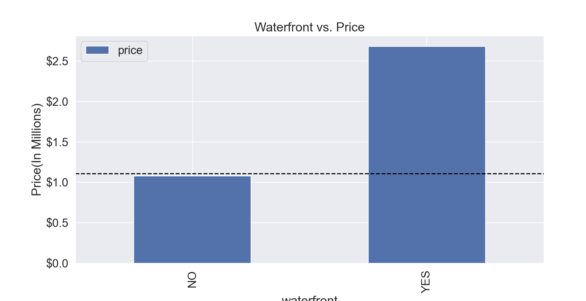
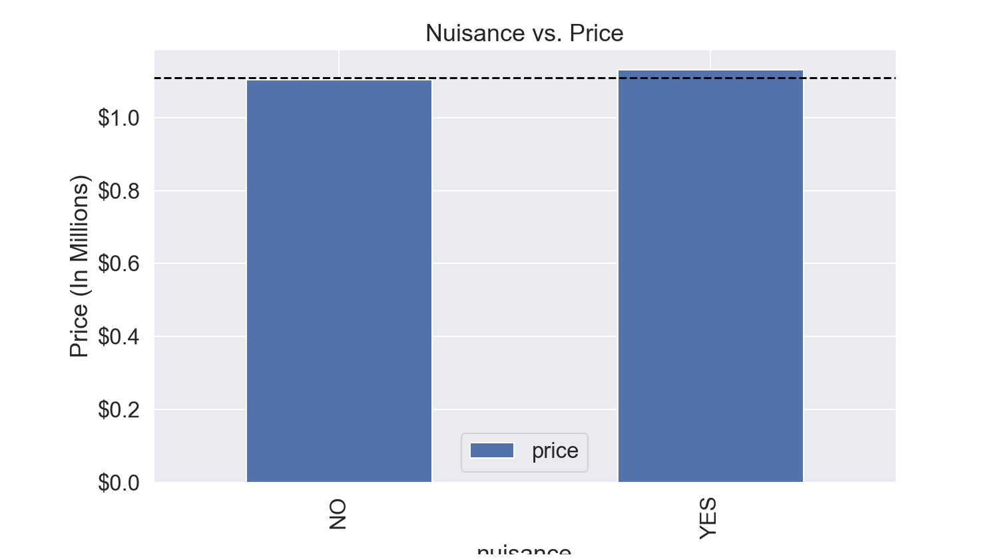

# King County Housing Data Project

## Overview

A company that buys houses to flip and resell is interested in finding out what pre-existine features of houses are likely to lead to a higher sale price. Since they plan on "flipping" the house, or adding their own renovations, they aren't as interested in details such as the overall condition of the house and are more interested in things such as location, how big of a lot the house is built on, etc.

## Business Understanding

The features of the data from a housing dataset that I will be looking at, and comparing to the sale price of the houses, include number of bedrooms, number of bathrooms, square footage of the living area, square footage of the lot, number of floors, whether the house is on a waterfront, whether the house is adjacent to a green belt, whether the house has traffic noise or other nuisances, and the quality of the view of the house. After performing exploratory data analysis and determining which of these factors seem to relate to sale price, I will narrow down my efforts to determine which of those factors are the best predictors of sale price.

## Data Understanding

I begin by importing the necessary modules and the dataset I will be using, which includes housing data for King County.

Next, I try to find out more about the data and narrow down the dataframe I will be using to only include the necessary columns.

## Data Preparation

Before I look at the predictors, I want to investigate the target variable ("price"). I start by plotting the target variable's distribution with a histogram and its residuals with a QQ plot. 

The histogram does not seem to show a perfectly normal looking distribution, and the QQ plot shows the residuals getting further and further away from the theoretical fit line. 
This indicates that the data becomes unreliable outside of plus or minus 2 standard deviations from the mean, or outside of the range where price equals between 684,205.75 and 2,901,227.43 dollars.

I then try to log transform the target variable to see if that improves its distribution or the distribution of its residuals. 

The log-transformed histogram of price looks more normal than the original variable's distribution.

This QQ plot is still not perfectly linear but is it better than before we log-transformed the target.
The data is still only reliable within the same same, so it likely is not worthwhile to use the log-transformed target feature moving forward as it will be harder to interpret.

#### Choosing a baseline model feature:

Next, I want to know which variables are most correlated with price, so that I can choose a feature for the baseline model. 
However, first I want to make sure that if any features are causing multicollinearity, that they are removed so that they will not later affect my results.
I do this by comparing all the features' correlations to see if any features are highly correlated with each other.

The only pairs of features that have correlations higher than 0.75 (high correlations) are sqft_living and sqft_above, and sqft_living and bathrooms. This makes sense, because the square feet of the living area is likely a large portion of the square feet above ground for a house. 

Also, it would make sense that the larger amount of square footage of living space, the higher number of bathrooms a house would have. Following this same logic, one might think that the 'bedrooms' feature would also cause multicollinearity. 

Looking at the correlations, I see that the bedrooms and bathrooms features are more correlated with the feature 'sqft_living' than they are with price, so this indicates multicollinearity.
Because sqft_living is the most correlated with the target variable out of these, I am going to exclude the variables sqft_above, bedrooms, and bathrooms moving forward.

###### Now, to look at the rest of the features: 

Paying more attention to which variables are correlated with price, as opposed to with each other, I compare the rest of the relevant numeric features.

Of the numeric variables in the data, aside from those already removed, it looks like the feature most correlated with price and having the strongest linear relationship with price is sqft_living. Therefore, this seems like a good feature to use for the baseline model.

The numeric variable here that appears to have the strongest positive linear relationship with price is sqft_living. As the feature most correlated with price and the one with the strongest linear relationship, sqft_living seems to  be a good variable to build a baseline model with to then compare other variables to.

Now, I want to investigate the distribution of sqft_living to see if it is normal and if its residuals follow the theoretical model.

The histogram of sqft_living does not look very normal, and much like the QQ plot of price, the residuals also tend to get further away from the theoretical line. To see if it improves the distribution, I am going to try log transforming this variable.

The transformed feature's distribution looks much more normal than the untransformed variable, and the residuals follow the theoretical line better as well.

## Modeling

First, a baseline model is created using the variable sqft_living, as it is the most correlated with sale price, to compare all other models to.

<!--This baseline model explains 37% of the variance in sale price of the houses in this dataset and it is statistically significant. Looking at the coefficients, for each increase by 1 square foot of living area, we expect the house's sale price to increase by $560-->

To further visualize these results, I plot the actual vs. predicted values for this model, the regression line, and the residuals.
###### Actuals vs. Predicted values:

###### The Regression Line:

###### The Residuals:

#### Numeric data:

I then add the other numeric features to a multiple linear regression to see if it improves our model.

These models look worse, so likely we included too many features. Since the numeric features of sqft_lot, and floors do not appear to have a positive linear relationship with price, we will remove those features.

#### Categorical data

Now, before the categorical variables can be modeled, they will need to be transformed using one-hot encoding.

For each of these categorical variables:

The model with waterfront explains about 5 percent of the variance in price and the F-statistic is statistically significant. Compared to houses that are not on a waterfront, we see a price increase of about 1,601,000 dollars for houses that are on a waterfront.

The model with greenbelt explains about 0.5 percent of the variance in price and the F-statistic is statistically significant. Compared to houses that are not near a greenbelt, we see a price increase of about 387,100 dollars for houses that are.

The model with nuisance explains 0 percent of the variance in price and it is statistically significant. This may indicate that this model is not suited for linear regression.

The model with view explains about 11.7 percent of the variance in price and it has an F-statistic of 0, so it is statistically significant. Compared to houses with an average view, we see a price increase of about 1,542,000 dollars for an excellent view, about 284,400 dollars for a good view, about 290,100 dollars for a fair view, and a decrease of about 433,400 dollars for no view.

Of the categorical variables, the ones that appear to be the best predictors of price are view and waterfront. 

## Regression Results 

### Creating a multiple regression model with sqft_living and view:
Since 'view' is the categorical variable that seems to be the best predictor of price, I am going to add it to a model with sqft_living to see if it is an improvement to the baseline.

###### Interpretation: 
This Model is statistically significant and explains about 41.6% of the variance in price, which is an improvement from the baseline model that only explains about 37%.

For each increase by 1 square foot of living space, we expect to see an increase in price of about 521 dollars.

Compared to a house with an average view, for a house with an excellent view we see an associated increase in price of about of about 1,196,00 dollars. 
For a house with a good view, we see an associated increase in price of about 88,750 dollars. 
For a house with a fair view, we see an associated increase in price of about 225,900 dollars.
For a house with no view, we see an associated decrease in price of about 182,400 dollars.

Since waterfront appeared to be the second most predictive categorical feature of price, I am interested to see if it improves this model as well. 
I added waterfront (one-hot encoded) to a model with view (one-hot encoded) and sqft_living.

###### Interpretation:
These plots look about the same and since this model explains 42.3% of the variance, this model may be an improvement to the baseline and to the first multiple linear regressions model.

### MAE for interpretability of models:

mae of baseline = 396335.99
Our baseline model is off by about $396,336 in a given prediction.

###### MAE for multiple linear regression models:
mae (first multiple linear regression model) = 388646.60
Our interaction model is off by about $384,550 in a given prediction. This is still high, but it is better than our baseline model.

mae (second multiple linear regression model) = 389498.98
The second multiple linear regression model is off by about $389,498.98 in a given prediction. This is more than the first mutiple linear regression model so this model is probably not the best model afterall.

The model with the most improvement overall to the baseline model is the <b>multiple linear regression model that included both sqft_living and view</b>. This model had a higher R-squared (adjusted) value than the baseline and it had a lower MAE (mean absolute error) value.

## Conclusion

The models created show that the features that are most predictive of house sale price are the square feet of living space and the quality of the view. If the stakeholder is to only go off of this information, those are the two factors that they should look for when deciding which houses to buy in order to flip and make the highest possible profits.

### Limitations:
As can be seen in the QQ plot of the target variable 'price', the model becomes unreliable more than plus or minus 2 standard deviations away from the mean, or outside of the price range of 684,205.75 and 2,901,227.43 dollars.
The best model that was found still only explained 41.6% of the variance in price and was still estimated to be off by about 388,646.60 dollars on a given prediction, which is a pretty high number.
Additionally, this dataset does not include information on certain housing features that would likely be even more related to sale price, such as the subdivision that the house is in.

### Next Steps:
In order to get a better idea of the true best predictors of housing sale prices, further analysis should be conducted on more datasets that include more features, such as housing subdivision.

